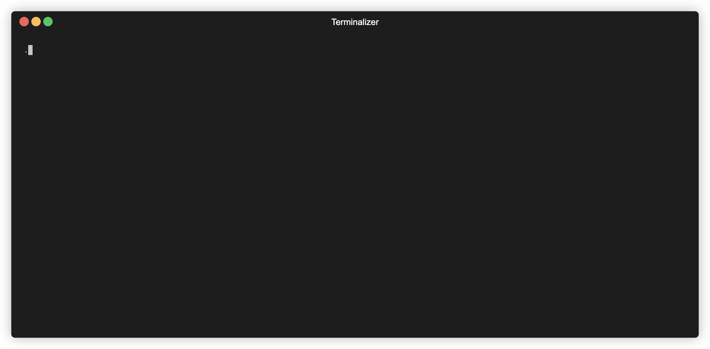

# saucectl XCUITest example

Example running saucectl with XCUITest.

## What You'll Need

The steps below illustrate one of the quickest ways to get set up. If you'd like a more in-depth guide, please check out
our [documentation](https://docs.saucelabs.com/testrunner-toolkit/installation).

### Install `saucectl`

```shell
curl -L https://saucelabs.github.io/saucectl/install | bash
```

⚠ Make sure saucectl version is newer than **v0.44.0**

### Set Your Sauce Labs Credentials

```shell
saucectl configure
```

## Running The Examples

Simply check out this repo, set your XCUITest test bundles and run the appropriate command below :rocket:
:bulb: We also provide [DemoApp](DemoApp/) to demonstrate the test workflow. Click [here](.github/workflows/test.yml) for more details on how to build your XCUITest test bundle.
### In Sauce Cloud

```shell
APP=<your-app-ipa-file> TEST_APP=<your-test-app-ipa-file> saucectl run
```



## The Config

[Follow me](.sauce/config.yml) if you'd like to see how saucectl is configured for this repository.

Our IDE Integrations (e.g. [Visual Studio Code](https://docs.saucelabs.com/testrunner-toolkit/ide-integrations/vscode)) can help you out by validating the YAML files and provide handy suggestions, so make sure to check them out!
