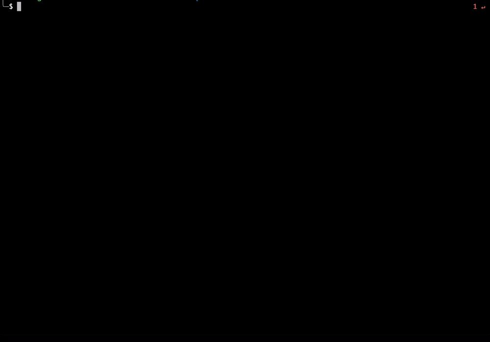

# saucectl XCUITest example

Example running saucectl with XCUITest.

## What You'll Need

The steps below illustrate one of the quickest ways to get set up. If you'd like a more in-depth guide, please check out
our [documentation](https://docs.saucelabs.com/dev/cli/saucectl/#installing-saucectl/).

_If you're using VS Code, you can use [Runme](https://marketplace.visualstudio.com/items?itemName=stateful.runme) to run the following commands directly from VS Code._

### Install `saucectl`

```shell
curl -L https://saucelabs.github.io/saucectl/install | bash
```

⚠ Make sure saucectl version is newer than **v0.44.0**

### Set Your Sauce Labs Credentials

```shell
saucectl configure
```

## Running The Examples

Simply check out this repo, set your XCUITest test bundles and run the appropriate command below :rocket:

:bulb: We also provide [DemoApp](DemoApp/) to demonstrate the test workflow. Click [here](.github/workflows/test.yml) for more details on how to build your XCUITest test pipeline.

### Build `DemoApp`

```shell
cd DemoApp

xcodebuild \
  CODE_SIGN_IDENTITY="" CODE_SIGNING_REQUIRED=NO CODE_SIGNING_ALLOWED=NO \
  clean build-for-testing \
  -project DemoApp.xcodeproj \
  -scheme "DemoApp" \
  -sdk iphoneos \
  -configuration Debug \
  -derivedDataPath build
```

### Run XCUITest on Sauce Cloud

```shell
APP=DemoApp/build/Build/Products/Debug-iphoneos/DemoApp.app \
TEST_APP=DemoApp/build/Build/Products/Debug-iphoneos/DemoAppUITests-Runner.app \
saucectl run
```


### Run XCUITest in Parallel

`saucectl` supports running tests in parallel. It requires `shard` and `testListFile` settings. Click [here](.sauce/sharding-config.yml) to check the details.

There is a script to extract test classes in `DemoApp`. So when you're building `DemoApp` in this example repo, it also generates a `DemoApp/test_classes.txt`. This file can be used for sharding XCUITest by concurrency. You can also set `testListFile` on demand.

```
APP=DemoApp/build/Build/Products/Debug-iphoneos/DemoApp.app \
TEST_APP=DemoApp/build/Build/Products/Debug-iphoneos/DemoAppUITests-Runner.app \
TEST_LIST_FILE=DemoApp/test_classes.txt \
saucectl run
```


## The Config

[Follow me](.sauce/config.yml) if you'd like to see how saucectl is configured for this repository.

Our IDE Integrations (e.g. [Visual Studio Code](https://docs.saucelabs.com/dev/cli/saucectl/usage/ide/vscode/)) can help you out by validating the YAML files and provide handy suggestions, so make sure to check them out!
